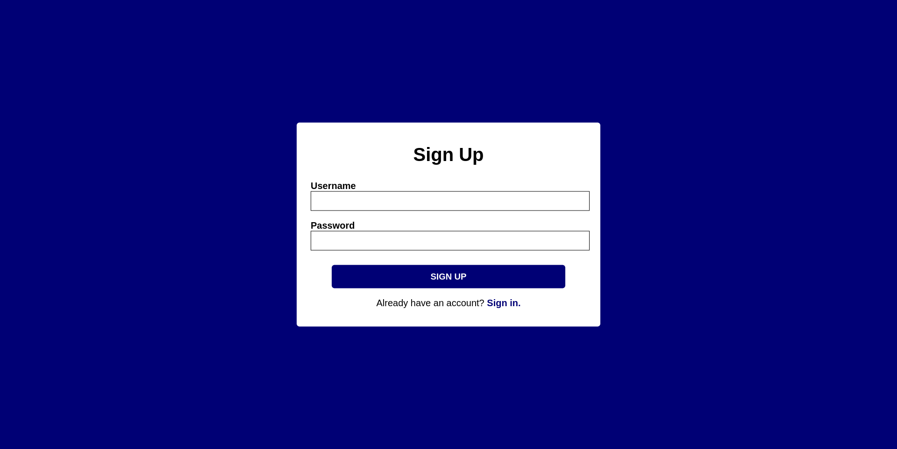
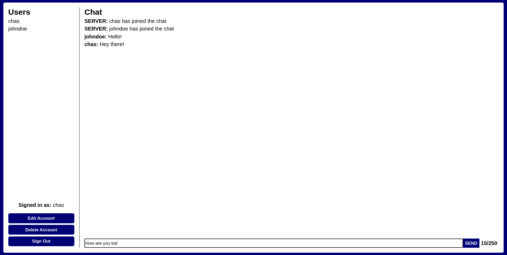
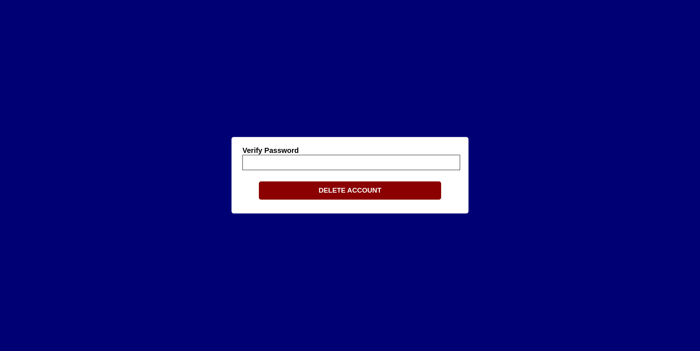

# Node.js Login Chat App

<strong>THIS IS A WORK IN PROGRESS, FEATURES MAY BE MISSING.</strong>

## What is this project?

A chatroom website written in Node.js using Socket.IO for communication between clients. Express.js and the Node.js implementation of SQLite are used for a login system allowing users to register, login, edit, and delete an account at any time. Passwords are hashed using bcrypt so they are stored securely in the database. 

## Features

🟢 = Fully working | 🟡 = Partly working/in progress | 🟠 = To be added | 🔴 = Broken

* Database 🟢
* Sign Up 🟢
* Sign In 🟢
* Session management system 🟢
* Homepage 🟢
* Edit account 🟢
* Delete account 🟢
* Remember me 🟢
* Two-step verification 🟠
* Mobile support 🟢
* List of connected users 🟢
* Message displayed on joining/leaving chat 🟢
* Sending and receiving messages 🟢
* Previous chat history displayed on joining 🟢
* 250 character limit on messages 🟢
* Administrator accounts with ban and delete powers 🟠
* Different chatrooms 🟠
* Changing username updates it in chat logs 🟠
* Deleting account updates it to "DELETED" in chat logs 🟠
* Session renewal on a regular basis 🟠

## Installation instructions

### Dependencies

* Node.js v17 or newer
* NPM package manager
* Git

### Terminal/command prompt

```
git clone https://github.com/chasc0des/nodejs-login-chat-app.git
cd nodejs-login-chat-app
npm install .
npm start
```

By default, the program can be accessed on ``http://localhost:8080`` or from another machine on your network, ``http://<YOUR IP ADDRESS>:8080``.

## Screenshots










```
nodejs-login-chat-app
├─ .VSCodeCounter
│  └─ 2023-10-07_00-38-16
│     ├─ details.md
│     ├─ diff-details.md
│     ├─ diff.csv
│     ├─ diff.md
│     ├─ diff.txt
│     ├─ results.csv
│     ├─ results.json
│     ├─ results.md
│     └─ results.txt
├─ .git
│  ├─ FETCH_HEAD
│  ├─ HEAD
│  ├─ branches
│  ├─ config
│  ├─ description
│  ├─ hooks
│  │  ├─ applypatch-msg.sample
│  │  ├─ commit-msg.sample
│  │  ├─ fsmonitor-watchman.sample
│  │  ├─ post-update.sample
│  │  ├─ pre-applypatch.sample
│  │  ├─ pre-commit.sample
│  │  ├─ pre-merge-commit.sample
│  │  ├─ pre-push.sample
│  │  ├─ pre-rebase.sample
│  │  ├─ pre-receive.sample
│  │  ├─ prepare-commit-msg.sample
│  │  ├─ push-to-checkout.sample
│  │  └─ update.sample
│  ├─ index
│  ├─ info
│  │  └─ exclude
│  ├─ logs
│  │  ├─ HEAD
│  │  └─ refs
│  │     ├─ heads
│  │     │  └─ main
│  │     └─ remotes
│  │        └─ origin
│  │           └─ HEAD
│  ├─ objects
│  │  ├─ info
│  │  └─ pack
│  │     ├─ pack-f636c72699cf5c369cf2e0b7a2162999ba5cf8a0.idx
│  │     └─ pack-f636c72699cf5c369cf2e0b7a2162999ba5cf8a0.pack
│  ├─ packed-refs
│  └─ refs
│     ├─ heads
│     │  └─ main
│     ├─ remotes
│     │  └─ origin
│     │     └─ HEAD
│     └─ tags
├─ .gitignore
├─ README.md
├─ app.js
├─ controller
│  ├─ auth.js
│  └─ view.js
├─ handler
│  └─ chat.js
├─ package-lock.json
├─ package.json
├─ public
│  ├─ delete.html
│  ├─ scripts
│  │  └─ home.js
│  ├─ sign-in.html
│  ├─ sign-up.html
│  └─ styles.css
├─ router
│  ├─ get.js
│  └─ post.js
├─ screenshots
│  ├─ 404.png
│  ├─ delete.png
│  ├─ edit.png
│  ├─ home.png
│  ├─ sign-in.png
│  └─ sign-up.png
└─ server.js

```